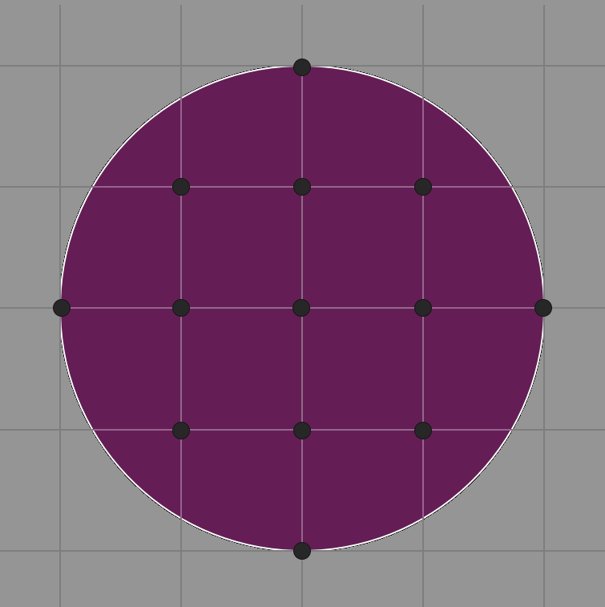

$\huge\color{cadetblue}{\text{Grid points on a disk}}$

<br/>

The input for this problem consists of a single integer $r$, representing the radius of a disk centered at $(0,0)$. The goal is to calculate and output the number of integer grid points that lie inside or on this disk. For example, as shown in the image below, there are exactly $13$ such grid points when $r = 2$.

A straightforward solution checks all grid points in the square with corners at $(-r,-r)$ and $(r,r)$, which leads to a time complexity of $\mathcal{O}(r^2)$. However, for this problem you are expected to design an algorithm that runs in $\mathcal{O}(r)$ time. The use of the `math.h` library is not allowed.

</br>

<p align="center">

</p><br clear="left"> 

<br/>

$\Large\color{darkseagreen}{\text{Examples}}$

```text
input:
  2
output:
  13

input:
  3
output:
  29

input:
  5
output:
  81
```
