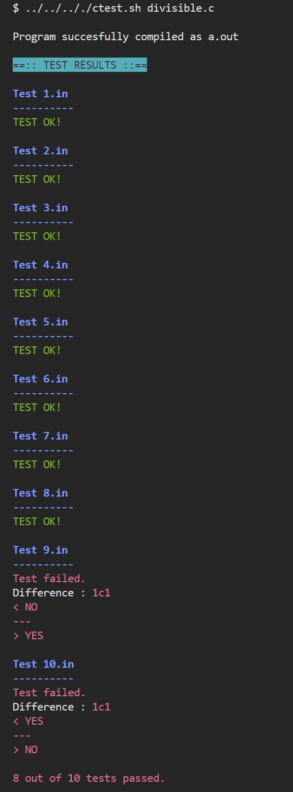

# Imperative Programming in C

Old exams for the course Imperative Programming (CS) at the University of Groningen.

## Final exams

- [2017 resit](https://github.com/pl3onasm/Imperative-programming/tree/main/Finals/2017resit)
- [2018](https://github.com/pl3onasm/Imperative-programming/tree/main/Finals/2018)
- [2018 resit](https://github.com/pl3onasm/Imperative-programming/tree/main/Finals/2018resit)
- [2019](https://github.com/pl3onasm/Imperative-programming/tree/main/Finals/2019)
- [2019 resit](https://github.com/pl3onasm/Imperative-programming/tree/main/Finals/2019resit)
- [2020](https://github.com/pl3onasm/Imperative-programming/tree/main/Finals/2020)
- [2021](https://github.com/pl3onasm/Imperative-programming/tree/main/Finals/2021)

## Midterm exams

- [2013](https://github.com/pl3onasm/Imperative-programming/tree/main/Midterms/mid2013)
- [2015](https://github.com/pl3onasm/Imperative-programming/tree/main/Midterms/mid2015)
- [2016](https://github.com/pl3onasm/Imperative-programming/tree/main/Midterms/mid2016)
- [2016 resit](https://github.com/pl3onasm/Imperative-programming/tree/main/Midterms/mid2016resit)
- [2017](https://github.com/pl3onasm/Imperative-programming/tree/main/Midterms/mid2017)
- [2017 resit](https://github.com/pl3onasm/Imperative-programming/tree/main/Midterms/mid2017resit)
- [2018](https://github.com/pl3onasm/Imperative-programming/tree/main/Midterms/mid2018)
- [2018 resit](https://github.com/pl3onasm/Imperative-programming/tree/main/Midterms/mid2018resit)
- [2019](https://github.com/pl3onasm/Imperative-programming/tree/main/Midterms/mid2019)
- [2019 resit](https://github.com/pl3onasm/Imperative-programming/tree/main/Midterms/mid2019resit)
- [2020](https://github.com/pl3onasm/Imperative-programming/tree/main/Midterms/mid2020)
- [2020 resit](https://github.com/pl3onasm/Imperative-programming/tree/main/Midterms/mid2020resit)
- [2021](https://github.com/pl3onasm/Imperative-programming/tree/main/Midterms/mid2021)
- [2021 resit](https://github.com/pl3onasm/Imperative-programming/tree/main/Midterms/mid2021resit)

## Compilation

```
gcc -O2 -std=c99 -pedantic -Wall -o a.out myprog.c -lm
```  

## Execution

```
./a.out < tests/input.in
```

## Testing

You can test your own code with the [test script](https://github.com/pl3onasm/Imperative-programming/blob/main/ctest.sh). It will compile your code and run it on all the test cases. It will also compare your output with the expected output. 

In order to use it, you basically have two options: 
### 1. Execution from script's location in the root of the repository  

First, make the script executable in the root folder:
```
chmod +x ctest.sh
```
Then run the script from the working directory containing your program, the solution, and the folder with the tests using the following command:
```
../../.././ctest.sh myprog.c
```

### 2. Execution from $PATH  

Alternatively, you can add the script to your PATH variable and run it from anywhere.  
To display the current $PATH, run the following command:
```
echo $PATH
```
Then, copy the script to one of the folders in the $PATH. For example:
```
sudo cp ctest.sh /usr/bin/
```
Now you can run the script from the directory containing your program and the folder with test cases using the following command:
```
ctest.sh myprog.c
```  

&nbsp;&nbsp;&nbsp;&nbsp;&nbsp;&nbsp;  
  
Note that if you want to use less, you should add the -r flag (to keep the colors intact):
```
ctest.sh myprog.c | less -r
```
You may also choose to redirect the output to a file:
``` 
ctest.sh myprog.c > results.txt
```
&nbsp;&nbsp;&nbsp;&nbsp;&nbsp;&nbsp;  
Example output of the test script:  
&nbsp;&nbsp;&nbsp;&nbsp;&nbsp;&nbsp;  

<p align="center" width="75%">
  
</p> 